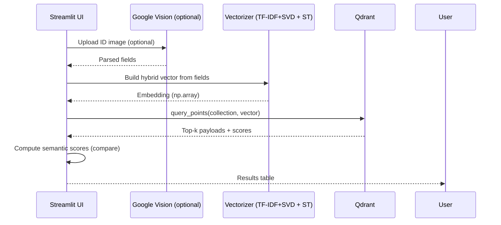

## Document Matching App (Legal Identity eKYC)

Production-ready pipeline for searching and matching legal identity records using a hybrid (TF‑IDF + SVD + Transformer) embedding and a Qdrant vector database, with an optional OCR flow via Google Cloud Vision. A Streamlit UI allows searching by structured text or by uploading an ID image.

### Features
- **Hybrid embedding**: Weighted TF‑IDF reduced with SVD concatenated with multilingual Sentence Transformer embeddings.
- **Vector search**: Qdrant used for fast similarity search over large identity datasets.
- **OCR support**: Extract fields from ID images using Google Cloud Vision.
- **Interactive UI**: Streamlit app with tabs for text search and OCR search.

### Architecture Overview




### Repository Structure
```text
document-matching-app/
  app/
    main.py                     # Streamlit UI (text search + OCR search)
    legal_identity_extract.py   # Field extraction utilities and LegalIdentity class
    legal_identity_matching.py  # ExtendedLegalIdentity + vectorization/comparison API
    sentence_transformer.py     # Vectorization/ensemble helpers (TF-IDF + SVD + Transformer)
    load_vector_point.py        # Build and upload vectors to Qdrant
    models/                     # (Optional duplicate) local model copies for app packaging
  models/                       # TF-IDF and SVD artifacts (v1..v3 provided)
  dataset/                      # Example dataset (DSDT.xlsx)
  config_li.json                # Vectorization config (weights, model name, alpha/beta, etc.)
  requirements.txt              # Python dependencies
```

### Quick Start
Prerequisites:
- Python 3.9–3.11
- Qdrant running locally on port 6333
  - Docker: `docker run -p 6333:6333 qdrant/qdrant:latest`
- (Optional for OCR) Google Cloud Vision enabled and service account JSON

1) Create and activate a virtual environment
```bash
python -m venv .venv
. .venv/Scripts/activate  # Windows PowerShell: . .venv/Scripts/Activate.ps1
```

2) Install dependencies
```bash
pip install -r requirements.txt
```

3) Configure environment (OCR, optional)
```bash
# Path to your Google service account JSON key
set GOOGLE_APPLICATION_CREDENTIALS=path\to\service-account.json   # Windows
export GOOGLE_APPLICATION_CREDENTIALS=path/to/service-account.json  # macOS/Linux
```

4) Ensure model artifacts exist
- The repo includes model files under `models/` (e.g., `LI-weighted-TFIDF-v1.pkl`, `LI-weighted-TFIDF-SVD-v1.pkl`).
- If you train new versions, update `config_li.json` → `model_version` to match (e.g., `v2`, `v3`).

5) Start Qdrant (if not already)
```bash
docker run -p 6333:6333 qdrant/qdrant:latest
```

6) Build the vector collection from the dataset
By default, `config_li.json` points to `dataset/DSDT.xlsx`. Use the helper in `app/load_vector_point.py` to upload points to Qdrant.

Option A — run a small script using the provided utilities:
```python
# scripts/build_collection.py
from app.load_vector_point import read_data_from_file, load_to_vector_points_v2

if __name__ == "__main__":
    records = read_data_from_file("dataset/DSDT.xlsx")
    load_to_vector_points_v2(records, collection_name="legal_collection_test3")
```
Run it:
```bash
python scripts/build_collection.py
```

Option B — modify and run the `__main__` section in `app/load_vector_point.py` to point at your dataset, then execute:
```bash
python -m app.load_vector_point
```

7) Launch the Streamlit app
```bash
streamlit run app/main.py
```
Open the printed local URL in a browser.

### How It Works
- `config_li.json` controls the embedding pipeline:
  - **field_weights**: integer weights for each field in the weighted text.
  - **transformer_model_name**: Hugging Face model (default: `sentence-transformers/paraphrase-multilingual-MiniLM-L12-v2`).
  - **alpha/beta**: scaling factors for the TF‑IDF‑SVD and Transformer parts of the final vector.
  - **model_dir/model_version**: where to load TF‑IDF and SVD artifacts: `LI-weighted-TFIDF-<version>.pkl` and `LI-weighted-TFIDF-SVD-<version>.pkl`.
  - **device**: `cpu` or `cuda`.

- Vectorization (two equivalent APIs provided):
  - `app/legal_identity_matching.py::ExtendedLegalIdentity.vectorize(...)` and `.compare(...)`
  - `app/sentence_transformer.py::vectorize(...)` and `compare(...)`

- Vector DB search:
  - `app/load_vector_point.py::NeuralSearcher.seach_by_legal_identity(...)` queries Qdrant with the hybrid vector and returns payloads with similarity scores.

### UI Preview and Output

Sample result format returned by the app:

| id_number | full_name       | dob        | gender | nationality | place_of_origin | place_of_residence | hometown | occupation        | similar_score | semantic_score |
|-----------|------------------|------------|--------|-------------|-----------------|--------------------|----------|-------------------|---------------|----------------|
| 6000214863| Nguyễn Văn Sơn   | 1990-01-01 | M      | 260         | Nam Đàn, Nghệ An| Xóm 3, Nam Lộc ... | 403      | Lao dong tu do    | 0.873         | 0.912          |
| 6000214868| Nguyễn Văn Son   | 1990-01-01 | M      | 260         | Nam Đàn, Nghệ An| Xóm 3, Nam Lộc ... | 403      | Lao dong tu do    | 0.862         | 0.903          |

Note: Mermaid diagrams render natively on GitHub. For local preview, ensure your Markdown viewer supports Mermaid or use GitHub web view.

### Training or Updating Models
If you want to re-train TF‑IDF/SVD on your own dataset:
1. Fit `TfidfVectorizer` on weighted text built from your records.
2. Fit `TruncatedSVD` to reduce dimensionality.
3. Save artifacts as:
   - `models/LI-weighted-TFIDF-<version>.pkl`
   - `models/LI-weighted-TFIDF-SVD-<version>.pkl`
4. Update `config_li.json` → `model_version`.

### Configuration Reference (`config_li.json`)
```json
{
  "field_weights": {"ID": 3, "TEN_CHINH": 3, "NGAY_SINH": 2, ...},
  "train_dataset_path": "dataset/DSDT.xlsx",
  "transformer_model_name": "sentence-transformers/paraphrase-multilingual-MiniLM-L12-v2",
  "alpha": 0.5,
  "beta": 1.0,
  "device": "cpu",
  "model_dir": "models",
  "model_version": "v1"
}
```

### Troubleshooting
- "Connection refused" to Qdrant: ensure Docker container is running and port 6333 is open.
- Missing Google Vision credentials: set `GOOGLE_APPLICATION_CREDENTIALS` to your JSON key.
- Model files not found: verify files exist in `models/` matching `model_version`.
- Large dependency footprint: consider creating a lean environment with only the essentials: `qdrant-client`, `streamlit`, `transformers`, `sentence-transformers`, `scikit-learn`, `pandas`, `openpyxl`, `torch`, `opencc`, `google-cloud-vision`.

### License
Specify your license here (e.g., MIT). If omitted, the default is “All rights reserved.”

### Acknowledgements
- Qdrant open-source vector database
- Hugging Face Transformers and Sentence-Transformers
- Streamlit
- Google Cloud Vision


